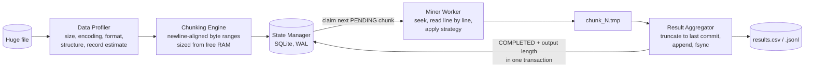
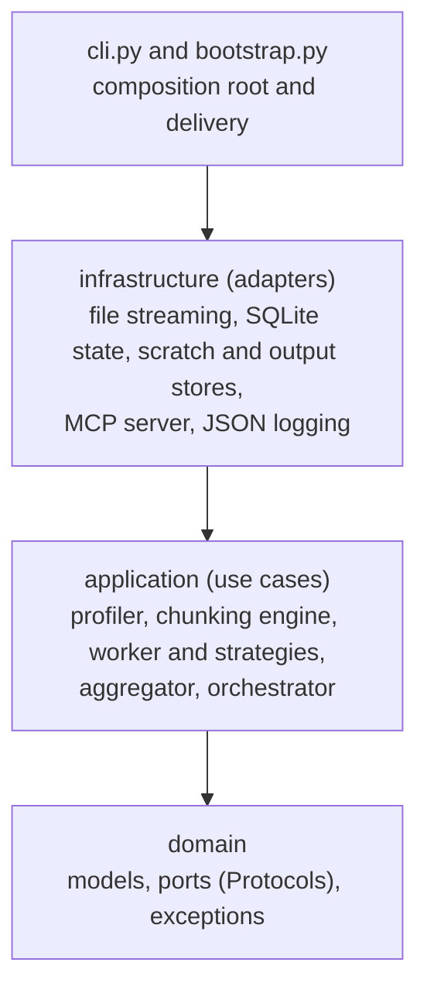

# DataMining Skill

**Mine huge files on a small machine, privately, and let an AI assistant drive it.**

A local-only, streaming-first data mining toolkit. It profiles, partitions and mines
CSV, JSONL and log files far larger than your RAM in constant memory, survives being killed
at any instant without losing or duplicating a single record, and plugs into Claude Code,
Claude Desktop, Cursor and any other [Model Context Protocol](https://modelcontextprotocol.io)
client as a tool.


- **Private by design.** Everything runs on your machine. No network code, no telemetry, no
  third-party packages. Your data is never sent anywhere.
- **Constant memory.** A 100 GB file on an 8 GB laptop is fine: every buffer is bounded, so
  memory depends on configuration, never on file size.
- **Crash-safe and resumable.** Kill it, lose power, run it again: the result is exactly what an
  uninterrupted run would have produced.
- **AI-ready.** A built-in MCP server exposes `profile_dataset` and `mine_dataset` to your
  assistant, with streamed progress and strict, workspace-confined file access.

## Contents

[Quick start](#quick-start) · [Use it from an AI assistant (MCP)](#use-it-from-an-ai-assistant-mcp) ·
[Command line](#command-line) · [Python API](#python-api) · [How it works](#how-it-works) ·
[Guarantees](#guarantees) · [Limitations](#limitations) · [Development](#development) ·
[Contributing](#contributing)

## Quick start

Requires Python 3.11 or newer. From a clone of this repository:

```bash
pip install .
```

Inspect a file without reading it into memory, then mine it:

```bash
# What is in this file? (milliseconds, constant memory)
datamining-skill profile events.csv

# Extract every e-mail address into a result file (resumable, crash-safe)
datamining-skill mine events.csv emails.csv
```

`profile` prints a JSON description (size, encoding, format, columns or keys, estimated
record count). `mine` writes `emails.csv` and prints a JSON summary. If `mine` is
interrupted, run the same command again: it resumes where it stopped.

Measured on a synthetic 10 GiB CSV (Windows development machine):

| Operation | Time | Memory growth |
| --- | --- | --- |
| Profile the file | ~50 ms | ~0.6 MiB |
| Plan chunks for 2 GiB of free RAM (34 chunks of 307 MiB) | ~26 ms | ~200 KiB |

## Use it from an AI assistant (MCP)

`datamining-skill mcp` runs a [Model Context Protocol](https://modelcontextprotocol.io) server
on standard input/output, so assistants can inspect and mine local files on your behalf.

| Tool | What it does |
| --- | --- |
| `profile_dataset` | Size, encoding, format, columns or JSON keys and an estimated record count for a CSV, TSV, JSONL or log file. Read-only. |
| `mine_dataset` | Extracts data (e-mail addresses by default) into a `.csv` or `.jsonl` result, in memory-bounded chunks with checkpoints. Streams progress. Calling it again resumes an interrupted run. |

**You decide which directories the assistant may touch.** Every file argument is resolved
(symlinks and `..` included) and must lie inside a directory you list with `--allow-dir`;
anything else is refused. The first `--allow-dir` is the workspace for relative paths.

### Claude Code

```bash
claude mcp add --scope project datamining-skill -- \
  datamining-skill mcp --allow-dir /absolute/path/to/your/data
```

or add the equivalent entry to `.mcp.json` at the project root:

```json
{
  "mcpServers": {
    "datamining-skill": {
      "command": "datamining-skill",
      "args": ["mcp", "--allow-dir", "/absolute/path/to/your/data"]
    }
  }
}
```

Run `/mcp` inside Claude Code to see that the server is connected, then ask, for example:
*"Profile `events.csv`, then extract all e-mail addresses from it into `emails.csv`."*

### Claude Desktop

Edit `claude_desktop_config.json` (macOS: `~/Library/Application Support/Claude/`, Windows:
`%APPDATA%\Claude\`) and restart the app:

```json
{
  "mcpServers": {
    "datamining-skill": {
      "command": "datamining-skill",
      "args": ["mcp", "--allow-dir", "/absolute/path/to/your/data"]
    }
  }
}
```

### Cursor

Create `.cursor/mcp.json` in your project (or `~/.cursor/mcp.json` for all projects):

```json
{
  "mcpServers": {
    "datamining-skill": {
      "command": "datamining-skill",
      "args": ["mcp", "--allow-dir", "${workspaceFolder}"]
    }
  }
}
```

### Configuration notes

- **Use the full path to the command if it is not on the client's `PATH`**, for example when
  you installed into a virtual environment. Either point at the console script
  (`/path/to/.venv/bin/datamining-skill`, or `...\.venv\Scripts\datamining-skill.exe` on
  Windows) or at the interpreter: `"command": "/path/to/.venv/bin/python", "args":
  ["-m", "datamining_skill", "mcp", "--allow-dir", "..."]`.
- **Windows paths in JSON need doubled backslashes** (`"C:\\Users\\you\\data"`); forward slashes
  also work.
- You can list several `--allow-dir` options, or set `DATAMINING_SKILL_ALLOWED_DIRS` (paths
  separated by `;` on Windows, `:` elsewhere). With neither, the server uses its working
  directory, and refuses to if that is the filesystem root.
- Results, state and scratch files go to `<first allowed dir>/.scratch/` and the result path you
  name. Add `.scratch/` to your `.gitignore`.
- Verify an installation without a client: `python scripts/mcp_smoke_test.py` performs a full
  handshake, profile and mine against the installed command and exits non-zero on any problem.

### Protocol and security

The server is written against the standard library only and speaks **both generations of MCP**:
the stateful `initialize` handshake (revisions 2024-11-05 to 2025-11-25) and the stateless
2026-07-28 revision (`server/discover`, per-request metadata). Messages are newline-delimited
JSON-RPC 2.0; nothing but protocol messages is ever written to stdout (logs go to stderr).

Because tool arguments come from a language model, treat them as untrusted:

- Paths are confined to the allowed directories; relative paths resolve inside the workspace.
  Symlinks and junctions are followed *before* the check, UNC and device paths, alternate data
  streams, reserved device names and control characters are rejected outright, and nothing is
  URL-decoded or expanded (`%00`, `~` and `$HOME` are ordinary file-name characters).
- `mine_dataset` only writes `.csv`, `.jsonl` or `.ndjson` files, never overwrites an existing
  result unless `overwrite` is set, and refuses to write over the source.
- Custom regular expressions are **off by default**: a model-written pattern can be crafted to
  backtrack catastrophically and stall your machine. Start the server with
  `--allow-custom-patterns` only if you accept that. The built-in e-mail extractor is safe on
  hostile input.

See [docs/privacy-and-security.md](docs/privacy-and-security.md) for the full threat model.

## Command line

```text
datamining-skill profile PATH [--config FILE]
datamining-skill mine SOURCE OUTPUT [--workspace DIR] [--pattern REGEX [--fields a,b]]
                                    [--overwrite] [--csv-formula-guard]
datamining-skill mcp [--allow-dir DIR ...] [--allow-custom-patterns]
```

All commands accept `--log-level {DEBUG,INFO,WARNING,ERROR}`, `--no-logs` and `--debug`.
Structured JSON logs go to stderr; results go to stdout. `python -m datamining_skill.cli ...` is
equivalent.

A failure prints a single `error:` line, never a Python traceback; add `--debug` to see the
traceback as well.

| Exit code | Meaning |
| --- | --- |
| 0 | Success |
| 1 | Unexpected internal error (rerun with `--debug` for the traceback) |
| 2 | Unsupported or unrecognised format (empty, binary, compressed, UTF-16/32 for `mine`, ...) |
| 3 | Unavailable source, invalid configuration, file-system error, low memory, job already running, or another library error |
| 4 | `mine` finished but some chunks failed (the first reason is printed); run again to retry them |
| 130 | Interrupted |
| 141 | The reader of stdout closed the pipe (for example `| head`) |

Mining examples:

```bash
# JSONL output instead of CSV (chosen by the extension)
datamining-skill mine events.csv emails.jsonl

# Extract your own pattern: each capture group becomes a column
datamining-skill mine app.log errors.csv --pattern "(\d{4}-\d\d-\d\d) ERROR (\w+)" --fields date,code

# Start over, discarding earlier progress and replacing the output
datamining-skill mine events.csv emails.csv --overwrite

# Opening the result in a spreadsheet? Neutralise formula injection
datamining-skill mine events.csv emails.csv --csv-formula-guard
```

State and scratch files live in `./.scratch/` (override with `--workspace`). A fresh run refuses
to overwrite an existing output file that it did not create.

## Python API

```python
from datamining_skill import create_profiler, run_mining

# Profile: size, encoding, format, structure, estimated record count
profile = create_profiler().profile("events.jsonl")
print(profile.data_format, profile.records.count, profile.structure.fields)

# Mine with managed state: resumes automatically if interrupted
summary = run_mining("events.csv", "emails.csv", on_progress=lambda p: print(p))
print(summary.to_dict())
```

Each stage is also available on its own:

```python
from datamining_skill import StateManager, create_chunking_engine, create_orchestrator

profile = create_profiler().profile("events.csv")

# 1. Plan: memory-aware, newline-aligned byte ranges (a lazy generator; nothing is read)
for chunk in create_chunking_engine().plan("events.csv", profile):
    print(chunk.chunk_id, chunk.start_byte, chunk.end_byte)

# 2. Mine with your own state database
with StateManager("data/run-001.sqlite3") as state:
    orchestrator = create_orchestrator(output_path="data/results.csv", state=state)
    summary = orchestrator.run("events.csv")      # safe to re-run after a crash
```

### Write your own mining logic

An `ExtractionStrategy` is a pure function from one line to zero or more records. It performs
no I/O; reading, writing and checkpointing are handled for you.

```python
from collections.abc import Iterator, Sequence
from datamining_skill import StateManager, create_orchestrator

class StatusCodes:
    fields = ("status",)

    def extract(self, line: str) -> Iterator[Sequence[str]]:
        if " 500 " in line:
            yield ("server-error",)

with StateManager("data/run-002.sqlite3") as state:
    create_orchestrator(
        output_path="data/errors.jsonl", state=state, strategy=StatusCodes()
    ).run("access.log")
```

## How it works



| Stage | What it guarantees |
| --- | --- |
| **Data Profiler** | Reports size, encoding, format and structure from bounded samples; the record count is extrapolated from windows spread across the file. Memory is O(1). |
| **Chunking Engine** | Chunk size is `min(15% of the RAM free now, 512 MiB)`. Boundaries are found by seeking, never by loading data, and always fall right after a newline. Refuses to run if free RAM is critically low. |
| **State Manager** | Every chunk is PENDING, IN_PROGRESS, COMPLETED or FAILED in a SQLite database (WAL mode). Chunks left IN_PROGRESS by a crash return to PENDING automatically. |
| **Miner Worker** | Reads exactly `[start_byte, end_byte)` line by line, in constant memory, and writes records to a private scratch file. |
| **Result Aggregator** | Appends a finished chunk to the output idempotently: the output's committed length is recorded in the same transaction as `COMPLETED`, and every append first truncates back to it. A crash at any point is repaired on restart. |

The code follows Clean Architecture; dependencies point inward only:



Design notes, diagrams and the crash-recovery analysis are in
[docs/architecture.md](docs/architecture.md).

## Guarantees

- **Local only.** The runtime imports no networking modules and has no dependencies.
- **Source files are read-only.** They are never modified, copied or indexed.
- **Footprint you can see.** Besides the result file you name, only a metadata-only state
  database and short-lived per-chunk scratch files are written, confined to `.scratch/` or
  `data/` (never the system temporary directory), owner-only (`0600`/`0700` on POSIX, a protected
  ACL on Windows), removed as chunks merge.
- **No content in logs or errors.** Logs and messages carry names, sizes, ids and counts.
- **Data is data.** Input is tokenised, never evaluated: no `eval`, `pickle` or dynamic import
  on the data path; JSON, CSV and regular-expression parsing use bounded, standard-library tools.
- **Exactly-once results.** Verified by killing real processes at three different points while
  mining a 50 MiB file: the output matched the planted records exactly, in order, every time.

## Limitations

- Compressed (`.gz`, `.zst`, ...) and binary formats (Parquet, SQLite) are rejected with a clear
  error; decompress or convert them first.
- A "record" is a physical line. Quoted CSV fields or log entries that span lines can be split
  across chunk boundaries.
- Mining supports ASCII-compatible encodings (ASCII, UTF-8, cp1252, ISO-8859-1). UTF-16/32 can be
  profiled but not mined.
- Mining is single-threaded. The CLI, `run_mining` and the MCP tool hold a cross-process lock per
  job, so a second process on the same source and output is refused ("already running"). Code that
  drives `create_orchestrator` directly must provide its own single-writer guarantee.
- If the source is truncated or replaced while it is being mined, the affected chunks fail with an
  explicit reason instead of silently dropping records. A file that is *replaced* by another of
  the same size cannot be detected.
- A failed chunk that succeeds on a retry is appended after the others, so output order can then
  differ from file order (no record is lost or duplicated).
- The MCP server handles one request at a time. It cannot interrupt a running tool call, but you
  can stop the process safely at any moment and call `mine_dataset` again to resume.
- Power loss can lose the most recent checkpoints (never corrupt data), so a few chunks may be
  mined again; this is why extraction must be idempotent, which it is by construction.

## Development

```bash
git clone <your fork> && cd datamining-skill
python -m venv .venv && source .venv/bin/activate     # Windows: .venv\Scripts\activate
pip install -e ".[dev]"

python -m mypy          # strict type checking
python -m pytest        # full suite: crash recovery, memory bounds, path security, MCP protocol
```

GitHub Actions runs the type check and the tests on Linux, macOS and Windows with Python
3.11 to 3.14, then builds the package and smoke-tests the installed wheel in a clean
environment. Validation scripts you can run yourself:

```bash
python scripts/generate_dummy_csv.py --size-gb 2 --output data/dummy_2gb.csv   # memory check
python scripts/simulate_crash_resume.py        # 100 chunks, killed at 50, resumed
python scripts/simulate_mining_crash.py        # 50 MiB mined, killed at chunk 3, three crash points
python scripts/mcp_smoke_test.py               # MCP handshake and tools against the installed command
```

Project layout:

```text
src/datamining_skill/
  domain/           value objects, exceptions, ports (no dependencies)
  application/      profiler, chunking engine, worker, strategies, aggregator, orchestrator
  infrastructure/   streaming, encoding, SQLite state, scratch/output stores, MCP server, logging
  bootstrap.py      composition root (create_profiler, run_mining, create_mcp_server, ...)
  cli.py            command line: profile, mine, mcp
tests/              pytest suite          scripts/    validation scripts
docs/               architecture and security notes
```

## Contributing

Contributions are welcome under any name or pseudonym. Please read
[CONTRIBUTING.md](CONTRIBUTING.md) and the [Code of Conduct](CODE_OF_CONDUCT.md). Report security
issues privately as described in [SECURITY.md](SECURITY.md). Changes are recorded in
[CHANGELOG.md](CHANGELOG.md).

## License

MIT. See [LICENSE](LICENSE). Copyright (c) 2026 DataMining Skill Contributors. CoreWorks Koray Uğrik
