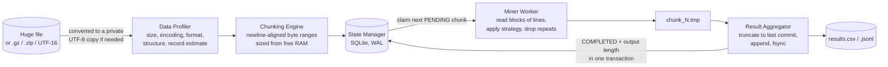
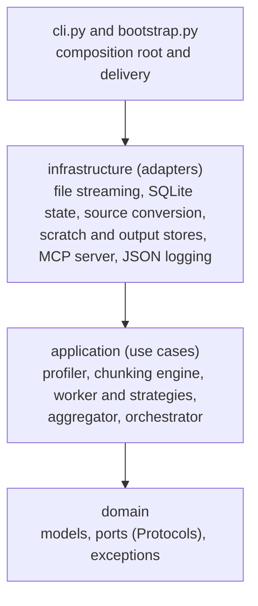

# DataMining Skill

A command-line tool, Python library and MCP server that pulls data out of very large text files
(CSV, TSV, JSON, JSON Lines and logs) on an ordinary computer. It reads a file in pieces, so the
memory it needs depends on its settings and not on the size of the file, and it keeps checkpoints,
so a run that was interrupted can be started again and carries on where it stopped.

It was written for one job in particular: getting a clean list of e-mail addresses out of a large
export or log. You can also give it your own regular expression. You can run it from a terminal,
call it from Python, or let an AI assistant that speaks the
[Model Context Protocol](https://modelcontextprotocol.io) (Claude Code, Claude Desktop, Cursor and
others) use it through the included MCP server and skill.

[](https://github.com/coreworkstr-art/datamining-skill/actions/workflows/ci.yml)


What to expect:

- Everything runs on your machine. The program has no network code, no telemetry and no
  third-party packages, and it never sends your data anywhere.
- Every buffer has a fixed upper size, so memory use follows the configuration and not the file.
  The test suite checks this, and the [Performance](#performance) figures include a 10 GiB file.
- If a run is killed or the power goes, running the same command again finishes the job with the
  same records an uninterrupted run would have written. [Limitations](#limitations) lists the
  details, such as the order of records after a retry.
- One command turns a messy export into a list of distinct, lower-case addresses. gzip, bzip2, xz
  and single-file zip archives, and Excel's "Unicode Text" (UTF-16) files, are read directly.
- For assistants there are five MCP tools, a Claude Code plugin and a skill that explains when to
  use them. File access is limited to the directories you list.

## Contents

[Install](#install) · [Quick start](#quick-start) · [Use it from an AI assistant](#use-it-from-an-ai-assistant) ·
[Command line](#command-line) · [Recipes](#recipes) · [Python API](#python-api) ·
[How it works](#how-it-works) · [Performance](#performance) · [Guarantees](#guarantees) ·
[Limitations](#limitations) · [Troubleshooting](#troubleshooting) · [Development](#development) ·
[Contributing](#contributing)

## Install

Python 3.11 or newer; nothing else is needed at runtime.

```bash
# with uv: the command gets its own isolated environment
uv tool install git+https://github.com/coreworkstr-art/datamining-skill

# or with pip
pip install git+https://github.com/coreworkstr-art/datamining-skill

# or from a clone, which also gives you the tests and the example data
git clone https://github.com/coreworkstr-art/datamining-skill && cd datamining-skill
pip install .
```

Check it works: `datamining-skill --version`, then `datamining-skill profile examples/contacts.csv`.

## Quick start

Inspect a file without reading it into memory, extract a clean address list, check the result:

```bash
# What is in this file? (milliseconds, constant memory)
datamining-skill profile examples/contacts.csv

# Every distinct e-mail address, lower-cased, one per line (resumable, crash-safe)
datamining-skill mine examples/contacts.csv emails.csv --unique --lowercase

# Look at the first records of the result
datamining-skill preview emails.csv --rows 5
```

`profile` prints a JSON description: size, encoding, format, columns or keys, and the record
count with its unit (a quoted CSV value can span lines, so a CSV is counted in lines). `mine`
writes `emails.csv` and prints a JSON summary:

```json
{
  "output_name": "emails.csv", "resumed": false, "chunks_total": 1, "chunks_processed": 1,
  "chunks_failed": 0, "records_written": 15, "duplicates_skipped": 3, "already_complete": false,
  "oversized_lines": 0, "source_transform": null, "first_error": null
}
```

If `mine` is interrupted, run the same command again: it resumes where it stopped. Run it again
after it finished and it says `already_complete` instead of doing the work twice. Changing any
setting (the pattern, `--unique`, ...) starts a new job.

## Use it from an AI assistant

`datamining-skill mcp` runs a [Model Context Protocol](https://modelcontextprotocol.io) server on
standard input/output, so an assistant can inspect and mine local files on your behalf.

| Tool | What it does |
| --- | --- |
| `profile_dataset` | Format, encoding, columns or keys, size and estimated record count of a CSV, TSV, JSON, JSONL or log file; also gzip, bzip2, xz and zip files. Read-only. |
| `mine_dataset` | Extracts data (e-mail addresses by default) into a `.csv` or `.jsonl` result in memory-bounded chunks with checkpoints. `unique`, `lowercase`, `csv_formula_guard` and `overwrite` options. With `wait=false` it runs in the background and returns a job id. |
| `mining_status` | Progress and result of a background run, or a list of the runs of this session. |
| `cancel_mining` | Stops a background run after its current chunk; calling `mine_dataset` again resumes it. |
| `preview_result` | The first records of a result file, so the assistant can verify the run. |

Every argument is described in [docs/mcp-tools.md](docs/mcp-tools.md).

The assistant can only reach the directories you list. Every file argument is resolved (symlinks
and `..` included) and must lie inside a directory given with `--allow-dir`; anything else is
refused. The first `--allow-dir` is the workspace for relative paths.

### Claude Code

The repository is a Claude Code plugin: it starts the server for you (with
[uv](https://docs.astral.sh/uv/), restricted to the project directory) and adds the
[`datamining` skill](skills/datamining/SKILL.md), which tells Claude when to use the tools and how
to choose their arguments.

```bash
claude plugin marketplace add coreworkstr-art/datamining-skill
claude plugin install datamining-skill@datamining-skill
```

Then ask, for example: *"Profile `events.csv`, then give me a clean list of the distinct e-mail
addresses in it, lower-cased."* Run `/mcp` to see that the server is connected.

Prefer to register the server yourself? After installing the command (see [Install](#install)):

```bash
claude mcp add --scope project datamining-skill -- \
  datamining-skill mcp --allow-dir /absolute/path/to/your/data
```

or add the equivalent entry to `.mcp.json` at the project root:

```json
{
  "mcpServers": {
    "datamining-skill": {
      "command": "datamining-skill",
      "args": ["mcp", "--allow-dir", "/absolute/path/to/your/data"]
    }
  }
}
```

### Claude Desktop

Edit `claude_desktop_config.json` (macOS: `~/Library/Application Support/Claude/`, Windows:
`%APPDATA%\Claude\`) and restart the app:

```json
{
  "mcpServers": {
    "datamining-skill": {
      "command": "datamining-skill",
      "args": ["mcp", "--allow-dir", "/absolute/path/to/your/data"]
    }
  }
}
```

### Cursor

Create `.cursor/mcp.json` in your project (or `~/.cursor/mcp.json` for all projects):

```json
{
  "mcpServers": {
    "datamining-skill": {
      "command": "datamining-skill",
      "args": ["mcp", "--allow-dir", "${workspaceFolder}"]
    }
  }
}
```

### Configuration notes

- **Use the full path to the command if it is not on the client's `PATH`**, for example when
  you installed into a virtual environment. Either point at the console script
  (`/path/to/.venv/bin/datamining-skill`, or `...\.venv\Scripts\datamining-skill.exe` on
  Windows) or at the interpreter: `"command": "/path/to/.venv/bin/python", "args":
  ["-m", "datamining_skill", "mcp", "--allow-dir", "..."]`.
- **Windows paths in JSON need doubled backslashes** (`"C:\\Users\\you\\data"`); forward slashes
  also work.
- You can list several `--allow-dir` options, or set `DATAMINING_SKILL_ALLOWED_DIRS` (paths
  separated by `;` on Windows, `:` elsewhere). With neither, the server uses its working
  directory, and refuses to if that is the filesystem root.
- Results, state and scratch files go to `<first allowed dir>/.scratch/` and the result path you
  name. Add `.scratch/` to your `.gitignore`.
- **Custom patterns** (`pattern` and `fields` arguments) are off by default: a model-written
  regular expression can be crafted to backtrack catastrophically and stall your machine. Start
  the server with `--allow-custom-patterns` only if you accept that. The built-in e-mail
  extraction is not affected: it uses bounded patterns, and the test suite runs it against hostile
  lines a megabyte long under a time limit.
- Verify an installation without a client: `python scripts/mcp_smoke_test.py` performs a full
  handshake, profile and mine against the installed command and exits non-zero on any problem.

The server is written against the standard library only and speaks both generations of MCP: the
stateful `initialize` handshake (revisions 2024-11-05 to 2025-11-25) and the stateless
2026-07-28 revision (`server/discover`, per-request metadata). Nothing but protocol messages is
ever written to stdout. Because tool arguments come from a language model they are treated as
untrusted; see [docs/privacy-and-security.md](docs/privacy-and-security.md) for the threat model.

## Command line

```text
datamining-skill profile PATH [--config FILE]
datamining-skill mine SOURCE OUTPUT [--workspace DIR] [--unique] [--lowercase]
                                    [--pattern REGEX [--fields a,b]] [--overwrite]
                                    [--csv-formula-guard] [--json-escapes {auto,on,off}]
                                    [--max-expanded-gib GIB] [--no-progress]
datamining-skill preview PATH [--rows N]
datamining-skill clean [--workspace DIR] [--all] [--dry-run]
datamining-skill mcp [--allow-dir DIR ...] [--allow-custom-patterns]
```

| Option | Meaning |
| --- | --- |
| `--unique` | Write each record once, across the whole file and across resumed runs. |
| `--lowercase` | Lower-case every value. With `--unique`, addresses differing only in case count once. |
| `--pattern`, `--fields` | Extract your own regular expression; each capture group becomes a column named by `--fields`. Repeat a group with `(?:...)`, not `(...)`. |
| `--overwrite` | Discard earlier progress and replace an existing output file. |
| `--csv-formula-guard` | Prefix CSV cells that start with `= + - @` so a spreadsheet does not run them. |
| `--json-escapes` | Decode JSON string escapes such as `\u0040` before searching: `auto` (JSON and JSON Lines sources with the built-in extraction), `on` or `off`. |
| `--max-expanded-gib` | Refuse a compressed source that expands beyond this size (default 64). |
| `--no-progress` | Hide the progress line, which appears only when stderr is a terminal. |
| `--workspace` | Where the `.scratch/` folder with state and scratch files lives (default: the current directory). |
| `--rows` | How many records `preview` shows (1 to 200, default 20). |
| `--all`, `--dry-run` | `clean` also removes unfinished jobs / only reports what it would remove. |

Every command also accepts `--log-level {DEBUG,INFO,WARNING,ERROR}` (structured JSON logs on
stderr, `WARNING` by default), `--no-logs` and `--debug`. Results go to stdout. A failure prints a
single `error:` line, never a Python traceback; add `--debug` to see the traceback as well.

| Exit code | Meaning |
| --- | --- |
| 0 | Success |
| 1 | Unexpected internal error (rerun with `--debug` for the traceback) |
| 2 | Unsupported or unrecognised format (empty, binary, an archive of several files, ...) |
| 3 | Unavailable source, invalid configuration, file-system error, low memory or disk, job already running, or another library error |
| 4 | `mine` finished but some chunks failed (the first reason is printed); run again to retry them |
| 130 | Interrupted (run the same command again to resume) |
| 141 | The reader of stdout closed the pipe (for example `| head`) |

A fresh run refuses to overwrite an existing output file that it did not create. State and
scratch files live in `./.scratch/`; `datamining-skill clean` removes those of finished jobs and
never touches a result file or a running job.

## Recipes

```bash
# A clean list of the distinct addresses in a big export
datamining-skill mine export.csv addresses.csv --unique --lowercase

# Straight from a compressed log, as JSON Lines
datamining-skill mine app.log.gz addresses.jsonl --unique --lowercase

# An Excel "Unicode Text" export (UTF-16) works like any other file
datamining-skill mine customers.txt addresses.csv --unique --lowercase

# A JSON export, including addresses spelled with \u0040 escapes
datamining-skill mine users.json addresses.csv --unique --lowercase

# Your own pattern: IPv4 addresses (note the non-capturing group), one column
datamining-skill mine access.log hosts.csv --pattern "(?:\d{1,3}\.){3}\d{1,3}" --fields ip

# A pattern with capture groups: each group becomes a column
datamining-skill mine app.log errors.csv --pattern "(\d{4}-\d\d-\d\d) ERROR (\w+)" --fields date,code

# Opening the result in a spreadsheet? Neutralise formula injection
datamining-skill mine export.csv addresses.csv --csv-formula-guard

# Start over, ignoring earlier progress
datamining-skill mine export.csv addresses.csv --overwrite
```

Typical gotchas are collected in [docs/troubleshooting.md](docs/troubleshooting.md).

## Python API

```python
from datamining_skill import profile_source, run_mining

# Profile: size, encoding, format, structure, estimated record count (a plain dictionary)
profile = profile_source("events.jsonl")
print(profile["format"], profile["records"]["count"], profile["structure"]["fields"])

# Mine with managed state: resumes automatically if interrupted
summary = run_mining("events.csv", "emails.csv", unique=True, lowercase=True,
                     on_progress=lambda p: print(p))
print(summary.to_dict())
```

Each stage is also available on its own:

```python
from datamining_skill import StateManager, create_chunking_engine, create_orchestrator, create_profiler

profile = create_profiler().profile("events.csv")

# 1. Plan: memory-aware, newline-aligned byte ranges (a lazy generator; nothing is read)
for chunk in create_chunking_engine().plan("events.csv", profile):
    print(chunk.chunk_id, chunk.start_byte, chunk.end_byte)

# 2. Mine with your own state database
with StateManager("data/run-001.sqlite3") as state:
    orchestrator = create_orchestrator(output_path="data/results.csv", state=state)
    summary = orchestrator.run("events.csv")      # safe to re-run after a crash
```

### Write your own mining logic

An `ExtractionStrategy` turns one line into zero or more records. It performs no I/O; reading,
writing and checkpointing are handled for you.

```python
from collections.abc import Iterator, Sequence
from datamining_skill import StateManager, create_orchestrator

class StatusCodes:
    fields = ("status",)

    def extract(self, line: str) -> Iterator[Sequence[str]]:
        if " 500 " in line:
            yield ("server-error",)

with StateManager("data/run-002.sqlite3") as state:
    create_orchestrator(
        output_path="data/errors.jsonl", state=state, strategy=StatusCodes()
    ).run("access.log")
```

A strategy may also take `start` and `stop` (`def extract(self, line, start=0, stop=None)`) and
report only the matches that begin in `[start, stop)`. It is then searched exactly even in lines
longer than 1 MiB, which arrive in overlapping windows; one that takes only the line sees each
window's own span, so a match that straddles two windows can be missed.

## How it works



| Stage | What it guarantees |
| --- | --- |
| **Data Profiler** | Reports size, encoding, format and structure from bounded samples; the record count is extrapolated from windows spread across the file. Memory is O(1). |
| **Chunking Engine** | Chunk size is `min(15% of the RAM free now, 512 MiB)`. Boundaries are found by seeking, never by loading data, and always fall right after a newline. Refuses to run if free RAM is critically low. |
| **State Manager** | Every chunk is PENDING, IN_PROGRESS, COMPLETED or FAILED in a SQLite database (WAL mode). Chunks left IN_PROGRESS by a crash return to PENDING automatically. It also keeps the 16-byte hashes behind `--unique`. |
| **Miner Worker** | Reads exactly `[start_byte, end_byte)` in constant memory and writes records to a private scratch file. A line longer than 1 MiB is searched in overlapping windows, never skipped or cut. |
| **Result Aggregator** | Appends a finished chunk to the output idempotently: the output's committed length is recorded in the same transaction as `COMPLETED`, and every append first truncates back to it. A crash at any point is repaired on restart. |

The code follows Clean Architecture; dependencies point inward only:



Design notes, diagrams and the crash-recovery analysis are in
[docs/architecture.md](docs/architecture.md).

## Performance

Measured on a Windows laptop with Python 3.14; speeds vary a lot between machines and moments,
so treat them as orders of magnitude.

| Operation | Result |
| --- | --- |
| Profile a 10 GiB CSV | about 50 ms, under 1 MiB of memory growth |
| Plan chunks for 2 GiB of free RAM (34 chunks of 307 MiB) | about 26 ms |
| Mine a 512 MiB log with an address every few kilobytes | 2 to 3 seconds (200+ MiB/s) |
| Mine a 517 MiB CSV with an address on every row | roughly 20 to 40 seconds (15 to 25 MiB/s) |

The built-in extraction looks for each `@` with a plain string search and runs the pattern only
around it, so sparse text is read at close to disk speed; text with an address on every line is
bound by the interpreter. Mining is single-threaded. See
[docs/troubleshooting.md](docs/troubleshooting.md#speed) for what helps.

## Guarantees

- The runtime imports no networking modules and has no dependencies.
- Source files are only read. They are never modified, indexed or kept. A compressed or UTF-16
  source is converted to a private temporary copy that is deleted when the job finishes.
- Besides the result file you name, only a small state database and short-lived scratch files are
  written. They stay in `.scratch/` or `data/`, never in the system temporary directory, and are
  readable by the owner only (`0600`/`0700` on POSIX, a protected ACL on Windows).
- Logs and error messages carry names, sizes, ids and counts, not file contents.
- Input is parsed and never evaluated: there is no `eval`, `pickle` or dynamic import on the data
  path, and JSON, CSV and regular-expression handling use bounded standard-library tools.
- Each record is written exactly once. This was tested by killing real processes at three
  different points while mining a 50 MiB file; the output matched the planted records exactly, in
  order, every time. A power cut is the one case that can repeat work, never corrupt it (see
  [Limitations](#limitations)).

## Limitations

- Binary formats (Parquet, SQLite, PDF) and compressed formats other than gzip, bzip2, xz and
  single-file zip (zstandard, 7-zip) are rejected with a clear error; convert them first.
- The built-in extraction finds `local@domain.tld` addresses. It does not match quoted local parts,
  the rarer local-part characters (`!#$&'*/=?^{|}~`) or hosts without a dot.
- A record is a physical line. A quoted CSV value that spans lines is searched line by line, and
  a record count of such a file is given in lines. There is no column targeting: to work on one
  column, write a pattern for that column's values.
- Mining is single-threaded, about 15 to 25 MiB/s when every row has a match.
- Mining supports ASCII-compatible encodings (ASCII, UTF-8, cp1252, ISO-8859-1) directly, and
  UTF-16/32 through the conversion copy, which needs temporary disk space for the converted text.
- The CLI, `run_mining` and the MCP tools hold a cross-process lock per job, so a second process
  on the same job is refused ("already running"). Code that drives `create_orchestrator` directly
  must provide its own single-writer guarantee.
- If the source is truncated or replaced while it is being mined, the affected chunks fail with an
  explicit reason instead of silently dropping records. A file replaced by another of the same
  size cannot be detected.
- A failed chunk that succeeds on a retry is appended after the others, so output order can then
  differ from file order (no record is lost or duplicated). With `--unique`, "first occurrence" then
  means first in processing order.
- A match longer than 4 KiB that lies inside a line longer than 1 MiB can be cut in two.
- The MCP server handles one request at a time; use `wait=false` for long runs. It cannot interrupt
  a running call, but you can stop the process safely at any moment and resume later.
- Power loss can lose the most recent checkpoints (never corrupt data), so a few chunks may be mined
  again; this is why extraction must be idempotent, which it is by construction.

## Troubleshooting

[docs/troubleshooting.md](docs/troubleshooting.md) lists the messages you may meet, what they mean
and what to do, and explains speed, disk use and clean-up. Open an issue with the output of
`datamining-skill --version` and a small synthetic file that reproduces the problem.

## Development

```bash
git clone https://github.com/coreworkstr-art/datamining-skill && cd datamining-skill
python -m venv .venv && source .venv/bin/activate     # Windows: .venv\Scripts\activate
pip install -e ".[dev]"

python -m ruff check .  # lint
python -m mypy          # strict type checking
python -m pytest        # full suite: crash recovery, memory bounds, path security, MCP protocol
```

GitHub Actions runs the lint, the type check and the tests on Linux, macOS and Windows with
Python 3.11 to 3.14, then builds the package and smoke-tests the installed wheel in a clean
environment. Validation scripts you can run yourself:

```bash
python scripts/generate_dummy_csv.py --size-gb 2 --output data/dummy_2gb.csv   # memory check
python scripts/simulate_crash_resume.py        # 100 chunks, killed at 50, resumed
python scripts/simulate_mining_crash.py        # 50 MiB mined, killed at chunk 3, three crash points
python scripts/mcp_smoke_test.py               # MCP handshake and tools against the installed command
```

Project layout:

```text
src/datamining_skill/
  domain/           value objects, exceptions, ports (no dependencies)
  application/      profiler, chunking engine, worker, strategies, aggregator, orchestrator
  infrastructure/   streaming, encoding, source conversion, SQLite state, scratch/output stores,
                    background jobs, MCP server, logging
  bootstrap.py      composition root (run_mining, profile_source, create_mcp_server, ...)
  cli.py            command line: profile, mine, preview, clean, mcp
.claude-plugin/     Claude Code plugin and marketplace manifests
skills/datamining/  the skill that teaches an assistant to use the tools
tests/              pytest suite          scripts/    validation and release scripts
docs/               architecture, tool reference, security and troubleshooting notes
examples/           a small sample file to try the commands on
```

## Contributing

Contributions are welcome under any name or pseudonym. Please read
[CONTRIBUTING.md](CONTRIBUTING.md) and the [Code of Conduct](CODE_OF_CONDUCT.md). Report security
issues privately as described in [SECURITY.md](SECURITY.md). Changes are recorded in
[CHANGELOG.md](CHANGELOG.md).

## Using it responsibly

E-mail addresses are personal data under the GDPR in the EU, the KVKK in Turkey and comparable
laws elsewhere. The program extracts whatever you point it at and cannot tell whether you may.
Make sure you have a lawful basis for processing the source data and for what you do with the
result, and keep result files as well protected as the source. Extracting addresses to send
unsolicited mail is a misuse of this tool.

DataMining Skill is an independent project. It is not affiliated with, endorsed or sponsored by
Anthropic, Cursor or the Model Context Protocol project. Claude, Claude Code, Claude Desktop and
Cursor are names of their owners, used here only to say which clients it works with.

## License

MIT. See [LICENSE](LICENSE). Copyright (c) 2026 DataMining Skill Contributors. CoreWorks Koray Uğrik
